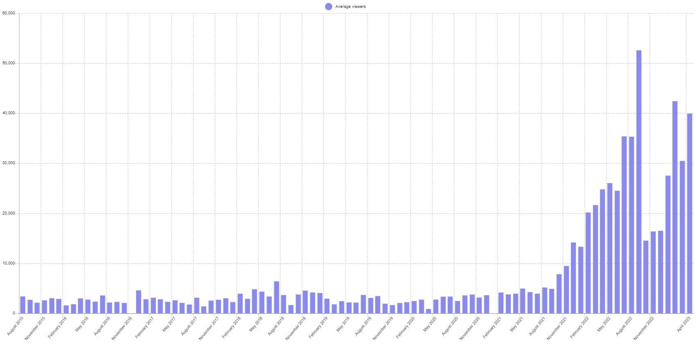
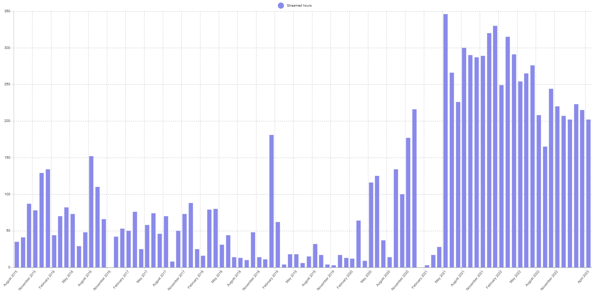

# Pro City

## Tarik

Tarik "tarik" Celik is a former CS:GO pro player. He is famous for winning a first and only Major[^major] tournament with a team called Cloud9 for North America as a region with American players[^only]. Not only did he win, but he won the HLTV Most Valuable Player reward and was the In-Game Leader[^IGL] for the team. Before becoming a pro player, he played on FACEIT and ESEA servers where he queue-sniped famous players to get recognition of his talent[^c1]. After a disappointing year 2021 he stepped down from an active roster to regain his form and reflecting on his IGL style while streaming on Twitch[^c2][^c3].
Tarik was regularly streaming before being benched, averaging 3278 viewers in 2020 with 1022 hours streamed. In December 2022 he averaged for the first time with over 10000 viewers after establishing his name in Valorant community[^c4].
  
    

## NeatQueue

NeatQueue is a Discord bot for custom matchmaking. It supports different types of matchmaking like 5v5, 3v3, 2v2v2v2 and more. Thanks to this flexibility, NeatQueue can matchmake without limitation to a certain game[^NQ]. It was developed and maintained by an user named NeatZ[^NZ].

### NeatQueue in Pro City

  Before match, new players that haven't played in Pro City before get MMR[^MMR] of 1000.

  1) Players join the queue.
  2) When the queue reaches 10 or more players, a match starts and a voice channel is created.
  3) When all players join the voice channel, two captains are randomly selected from four people with the highest MMR.
  4) Captains alternate choosing players to their team.
  5) Captains alternate on vetoing maps, until one map remains.
  6) Discord bot moves players into two new voice channels based on their team.
  7) Someone creates a custom lobby and players wait until they are invited into the lobby[^someone].
  8) Players move themselves into a correct team.
  9) When both teams in chat confirms that their team is ready, lobby creator starts the game.
  10) When the game ends, someone has to submit to the NeatQueue bot who wins.
  11) NeatQueue distributes MMR changes to players.

  After each month player with highest MMR wins and players' MMR is reseted.

## Pro City updates
  
- allowed by Riot
- prizepool
- issues
  - inactivity
  - long queue - bad for viewers too
  - automated bot twitter (promotion for procity and streamers)
  - procity leaderboard is slow
  - fossabot pro city api/bot <https://www.reddit.com/r/Twitch/comments/kd82fk/comment/gwy631d/?utm_source=share&utm_medium=web2x&context=3>

[^major]: Major tournaments are tournaments with a prize pool of at least $1,000,000 that are sponsored by Valve, the publisher of CS:GO.
<https://liquipedia.net/counterstrike/Majors>

[^only]: Cloud9 is not the only American organization or a team in North America region to win a Major tournament, but the rosters were not American (2015 Team Envy - French roster, 2016 Luminosity Gaming - Brazilian roster, 2016 SK Gaming - European organization with Brazilian roster, 2022 Faze - European team with mostly European players) <https://liquipedia.net/counterstrike/Majors#List_of_CS:GO_Major_Championships>

[^IGL]: In-game leader decides what players do as a team before the round and during the game based on circumstances.

[^c1]: <https://www.reddit.com/r/GlobalOffensive/comments/27hjq2/this_topless_turkish_dude_rekt_hiko_on_mirage/>

[^c2]: <https://twitter.com/EvilGeniuses/status/1382785936132603911>

[^c3]: <https://www.twitlonger.com/show/n_1srlmbt>

[^c4]: <https://sullygnome.com/channel/tarik/14/longtermstats>

[^NQ]: <https://top.gg/bot/857633321064595466>

[^NZ]: <https://top.gg/user/199020001941192704>

[^MMR]: MMR is an acronym for matchmaking rating. To ensure competitive game between two teams, average MMR of both teams should be as close as possible and the difference between players' MMR should be also as small as possible. After each match players' MMR change based on win or lose and ideally based on their performance too.

[^someone]: It is not by default determined who creates a lobby. The lobby creator usually does not have all players added to creator's friend list, therefore people that have joined the lobby should invite players that are not invited yet.
